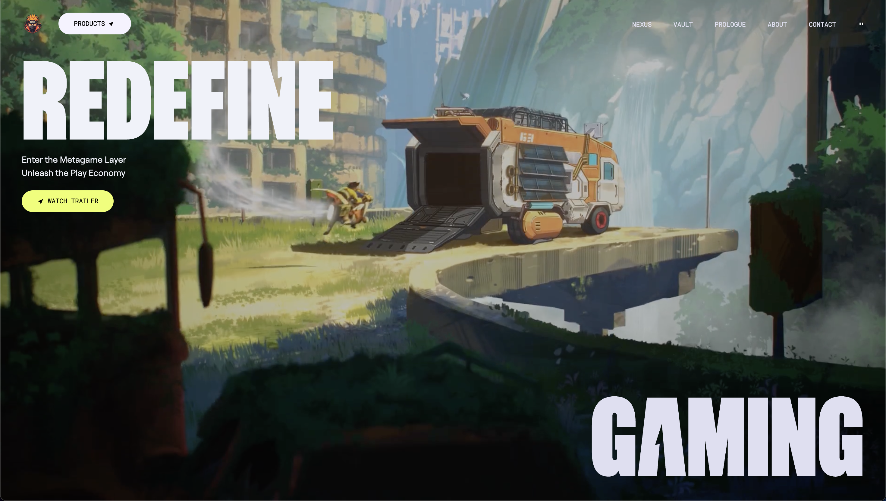

# ZENTRY - Award-Winning Gaming Website

<div align="center">
  

  <div>
    
    
    
  </div>
</div>

## 📋 Table of Contents

1. [Project Overview](#project-overview)
2. [Demo](#demo)
3. [Tech Stack](#tech-stack)
4. [Key Features](#key-features)
5. [Implementation Highlights](#implementation-highlights)
6. [Installation & Setup](#installation--setup)
7. [Project Structure](#project-structure)
8. [Performance Optimizations](#performance-optimizations)
9. [Challenges & Solutions](#challenges--solutions)
10. [Future Enhancements](#future-enhancements)
11. [Team](#team)

## � Project Overview

ZENTRY is a visually stunning, interactive website for a gaming platform that connects players to a metaverse layer. The site features premium animations, 3D effects, and a futuristic design that creates an immersive user experience. This project was built for the [Hackathon Name] with a focus on pushing the boundaries of web design and frontend development.

The website showcases a gaming platform that integrates various products into an interconnected overlay experience, emphasizing the "metagame layer" concept through engaging visuals and smooth interactions.

## 🎮 Demo

- **Live Demo**: [https://zentry-gaming.vercel.app](https://zentry-gaming.vercel.app)
- **Video Walkthrough**: [Watch Demo](https://youtu.be/demo-link)

## ⚙️ Tech Stack

- **Frontend Framework**: React.js
- **Animation Library**: GSAP (GreenSock Animation Platform)
- **Styling**: Tailwind CSS
- **Icons**: React Icons, Lucide React
- **Build Tool**: Vite
- **Deployment**: Vercel

## 🔋 Key Features

- **Immersive Hero Section**: Dynamic video backgrounds with parallax effects
- **Advanced Animations**: Scroll-triggered animations using GSAP
- **3D Interactive Elements**: Hover effects with 3D transformations
- **Premium Glassmorphism**: Modern UI with frosted glass effects
- **Responsive Design**: Optimized for all device sizes
- **Performance Optimized**: Fast loading times with efficient animations
- **Accessibility Focused**: WCAG compliant with reduced motion support

## 💡 Implementation Highlights

### GSAP Animation System

We implemented a comprehensive animation system using GSAP that includes:

- Scroll-triggered reveals and parallax effects
- 3D tilt effects on cards and interactive elements
- Staggered animations for content sections
- Custom easing functions for natural movement

### Premium UI Components

- **BentoTilt Cards**: Interactive cards with 3D tilt effects
- **Glassmorphism Testimonials**: Premium testimonial cards with dynamic hover states
- **Animated Navigation**: Smooth transitions in the navigation system
- **Video Integration**: Seamless video backgrounds with performance optimizations

### Responsive Design Strategy

The website maintains its premium feel across all device sizes through:

- Fluid typography and spacing
- Conditional rendering of heavy animations on mobile
- Optimized layouts for different viewport sizes
- Reduced motion options for accessibility

## 🛠️ Installation & Setup

```bash
# Clone the repository
git clone https://github.com/anuj846k/zentry-website.git
 
# Navigate to the project directory
cd zentry-website

# Install dependencies
npm install

# Start the development server
npm run dev

# Build for production
npm run build
```

## 📁 Project Structure

```
/
├── public/              # Static assets
│   ├── fonts/           # Custom fonts
│   ├── img/             # Images
│   └── videos/          # Video assets
├── src/
│   ├── components/      # React components
│   ├── App.jsx          # Main application component
│   ├── index.css        # Global styles
│   └── main.jsx         # Entry point
└── README.md            # Project documentation
```

## ⚡ Performance Optimizations

- Lazy loading of video assets
- Conditional rendering of heavy animations
- CSS containment for layout optimization
- GSAP timeline management for animation performance
- Optimized asset loading with proper formats (WebP, AVIF)
- Reduced motion options for users who prefer minimal animations

## 🧩 Challenges & Solutions

### Challenge 1: Complex Animation Sequencing

**Solution**: Implemented a custom GSAP timeline management system that coordinates animations based on scroll position and user interactions.

### Challenge 2: Responsive 3D Effects

**Solution**: Created adaptive 3D transformations that adjust based on device capabilities, with fallbacks for devices that can't handle intensive 3D rendering.

### Challenge 3: Video Performance

**Solution**: Implemented a custom video loading strategy that prioritizes initial content display while videos load in the background.

## 🔮 Future Enhancements

- WebGL integration for more advanced 3D effects
- Interactive product demos
- User authentication system
- Personalized content based on user preferences
- Integration with gaming APIs for live data

## � Team

- **Anuj Kumar** - Frontend Developer & Designer


---

<div align="center">
  <p>Built with ❤️ for Level Up Vibe Coding Hackathon by outlier AI </p>
</div>
